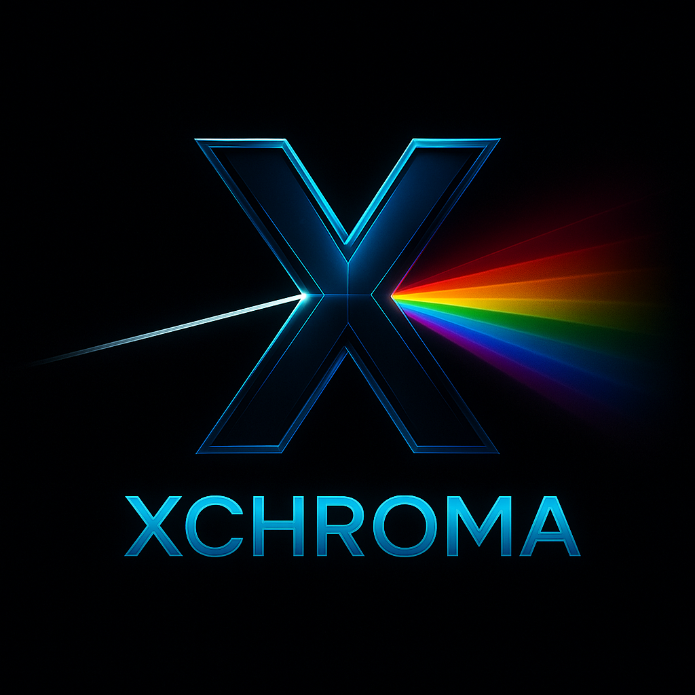
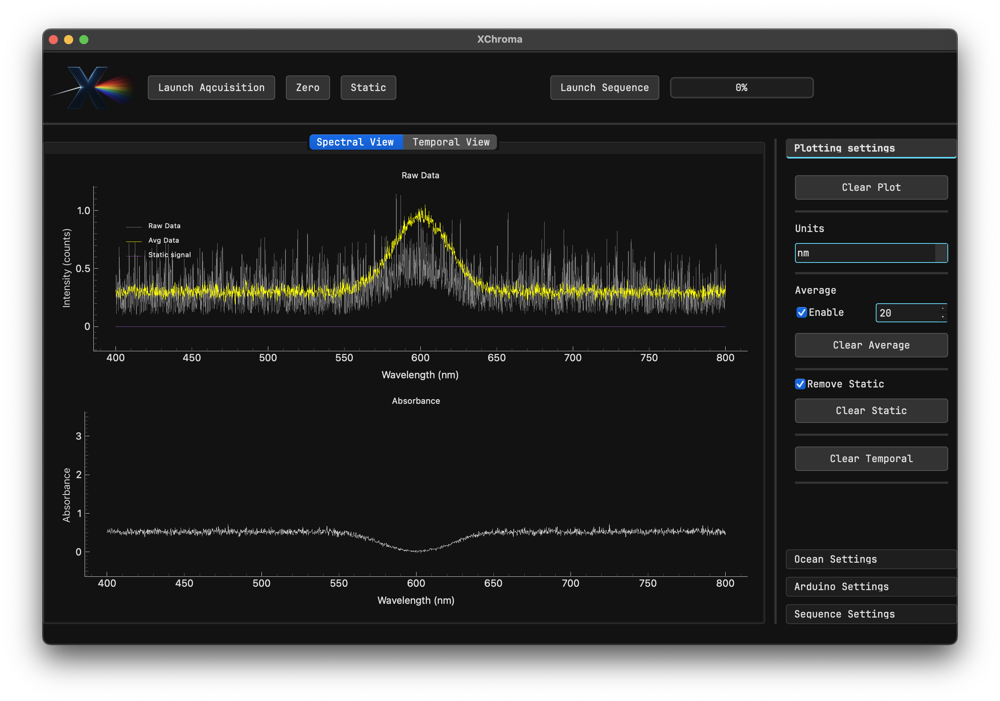

# XChroma



XChroma is a Python-based experiment control software designed to manage and automate optical experiments for measuring the quantum yield and photofatigue of photoswitchable proteins. It supports programmable experimental sequences, allowing users to define custom light protocols for photoactivation and switching cycles.

## Table of Contents

- [Features](#features)
- [Installation](#installation)
- [Usage](#usage)
- [Screenshots](#screenshots)
- [Project Structure](#project-structure)
- [Development](#development)
- [Contributing](#contributing)
- [License](#license)
- [Future Documentation](#future-documentation)

## Features

- **Experiment Control:** Interfaces with hardware to manage light protocols and measure fluorescence properties.
- **Programmable Sequences:** Define and execute custom sequences to trigger photoswitchable proteins under various conditions.
- **Real-Time Data Acquisition:** Collect and process experimental data in real time.
- **Modular Design:** Easy to extend with additional experimental protocols and analysis routines.
- **Python-Based:** Leverages Python’s ecosystem for scientific computing and rapid prototyping.

## Installation

1. **Clone the repository:**
    ```bash
    git clone https://github.com/Alex6Crbt/XChroma.git
    cd XChroma
    ```

2. **Install the required packages:**
    ```bash
    pip install -r requirements.txt
    ```

## Usage

Run the main control script to start the experiment:
```bash
python main.py
```
This script initializes the experimental setup, executes programmable light sequences, and measures parameters such as quantum yield and photofatigue.

The `sequence.py` module allows you to customize and define your own experimental sequences. Edit this file to adjust the timing and light protocol parameters for your specific experiment.

## Screenshots

Below is a screenshot of the XChroma application in action:



## Project Structure

```
XChroma/
├── assets/
│   └── images/
│       ├── logo.png
│       └── screenshot.png
├── .gitignore
├── README.md          # This file
├── requirements.txt   # Python dependencies
├── main.py            # Main entry point for experiment control
└── sequence.py        # Module for programmable sequence definitions
```

- **main.py:** Contains the core logic for controlling the experiment.
- **sequence.py:** Defines programmable light sequences used during experiments.
- **assets/images:** Contains the logo and screenshot images.

## Development

- **Setting Up a Development Environment:**
  1. Clone the repository and install dependencies.
  2. Use your preferred Python IDE or text editor.
  3. Modify `sequence.py` and update `main.py` to add new experimental protocols or analysis routines.

- **Testing:**
  (Include any unit tests or instructions for testing if available.)

## Contributing

Contributions are welcome! To contribute:

1. Fork the repository.
2. Create a feature branch (`git checkout -b my-feature`).
3. Make your changes and test them.
4. Open a pull request describing your changes.

For major changes, please open an issue first to discuss your ideas.

## License

This project is licensed under the MIT License – see the [LICENSE](LICENSE) file for details.

## Future Documentation

More in-depth user guides, API documentation, and tutorial videos will be added soon. Stay tuned for updates!
