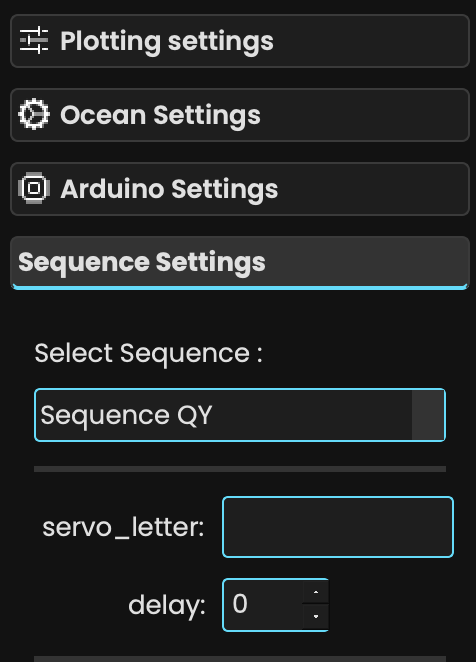

Custom Sequence
===============

XChroma is built to handle custom-made acquisition sequences for your experiments.
To do this, you must write a class inherited from the ``SequenceWorker`` class, define your custom ``run`` method, and then export it and define arguments in the ``main.py`` file.

Directory structure of the files used :

.. code-block:: bash

    XChroma/
    ├── XChroma/
    ├── main.py
    └── sequence.py

A Simple Sequence
-----------------

Let's build a simple sequence that performs measurements to get absorbance and save it.

Step 1: Define the Class in ``sequence.py``
*******************************************

First, let's define the class in the ``sequence.py`` file:

.. code-block:: python

    from XChroma.sequence_control import SequenceWorker

    class SequenceSimple(SequenceWorker):
        def run(self):
            # Here goes the sequence code

The class needs to be inherited from the :class:`XChroma.sequence_control.SequenceWorker`.

Step 2: Define the Measurements
*******************************

To get the absorbance spectrum, we need 3 different measurements:

- The intensity spectrum of interest
- A baseline from a reference curve (zero)
- A dark signal spectrum

We will also use ``input()`` to introduce delays between the measurements.

.. code-block:: python

    from XChroma.sequence_control import SequenceWorker

    class SequenceSimple(SequenceWorker):
        def run(self):
            print("Sequence started!")
            self.reset_servo() # Make sure all shutter are closed to start
            self.controller.send_command("a")  # Open the shutter for the probe signal

            # Measurement of the baseline
            _ = input("Put the Baseline (zero) sample. Please ensure you get signal from the spectrometer.")

            self.data_spectro.lavg.clear()
            time.sleep(10)  # Wait for automatic averaging as defined in the interface
            self.data_spectro.save_data(self.data_spectro.avg_i, cycle=0, spectype="zero", csv_path="Spectrums.csv")
            self.data_spectro.zero = self.data_spectro.avg_i

            self.progress_signal.emit(int(33))  # Update progress bar to 33%

            # Measurement of the sample
            _ = input("Put the sample.")

            self.data_spectro.lavg.clear()
            time.sleep(10)  # Wait for automatic averaging as defined in the interface
            self.data_spectro.save_data(self.data_spectro.avg_i, cycle=0, spectype="sample", csv_path="Spectrums.csv")
            self.data_spectro.zero = self.data_spectro.avg_i

            self.progress_signal.emit(int(66))  # Update progress bar to 66%

            # Measurement of the static signal
            self.reset_servo()  # Make sure servos are shut for the dark measurement
            time.sleep(10)  # Wait for automatic averaging as defined in the interface
            self.data_spectro.save_data(self.data_spectro.avg_i, cycle=0, spectype="static", csv_path="Spectrums.csv")
            self.data_spectro.static = self.data_spectro.static

            self.progress_signal.emit(int(100))  # Update progress bar to 100%

            self.controller.send_command("a")  # Open the shutter to view the result in the app

            self.finished_signal.emit()  # Mandatory!

Step 3: Use the Sequence in ``main.py``
***************************************

Now, in the ``main.py`` file, import your custom sequence:

.. code-block:: python

    from sequence import SequenceSimple

Then, add it to the ``sequence_dict``:

.. tab-set::
    .. tab-item:: Using the ``sequence_dict`` directly

        .. code-block:: python

            sequence_dict = {
                "Sequence Simple": {"class": SequenceSimple, "args": {}},
            }

    .. tab-item:: Alternative approach for adding the sequence

        .. code-block:: python

            sequence_dict["Sequence Simple"] = {"class": SequenceSimple, "args": {}}

Step 4: Run Your Application
****************************

You can run your app and see the results !

.. code-block:: bash

    python main.py

Adding GUI control
------------------

To add GUI control over the parameters of the Sequence, some steps differ from the basic sequence.

Update the Class Definition
***************************

First, modify the class to include a new ``__init__`` method to handle the additional parameters coming from the GUI. The class will now accept parameters such as `delay` and `servo_letter` from the GUI, in addition to `controller` and `data_spectro`.

.. code-block:: python

    from XChroma.sequence_control import SequenceWorker

    class SequenceSimple(SequenceWorker):
        def __init__(self, controller, data_spectro, delay, servo_letter):
            super().__init__(controller, data_spectro)  # Mandatory!
            self.delay1 = delay  # Store delay value
            self.servo_letter = servo_letter  # Store servo letter for reuse in the run method

        def run(self):
            # Here goes the sequence code

.. caution::

    In this case, the ``controller`` and ``data_spectro`` arguments need to be passed to the parent class (via ``super()``), and the additional arguments can be of type ``str``, ``float``, or ``int``.

Add the Sequence to ``main.py``
*******************************

To use this new sequence in ``main.py``, you need to update the ``sequence_dict`` to pass the new arguments (``servo_letter`` and ``delay``).

.. tab-set::
    .. tab-item:: Using the ``sequence_dict`` directly

        .. code-block:: python

            sequence_dict = {
                "Sequence Simple": {"class": SequenceSimple, "args": {"servo_letter": str, "delay": int}},
            }

    .. tab-item:: Alternative approach for adding the sequence

        .. code-block:: python

            sequence_dict["Sequence Simple"] = {"class": SequenceSimple, "args": {"servo_letter": str, "delay": int}}

.. caution::
    Don't forget to define the parameters correctly in the GUI before running the sequence.

Run the Application
*******************

Once everything is set up, you can run the app with:

.. code-block:: bash

    python main.py

Use GUI Parameters in the ``run`` Method
****************************************

Now that you have added the necessary parameters to the class, you can use these GUI-defined parameters of the ``run`` method.

For example, you can use the ``delay`` parameter to add a sleep time before running the next step, and the ``servo_letter`` parameter to control witch servo is used:

.. code-block:: python

    def run(self):
        time.sleep(self.delay1)  # Use the delay parameter defined in the GUI
        self.controller.send_command(self.servo_letter)  # Send the command with the selected servo letter
        # Add more sequence steps...
