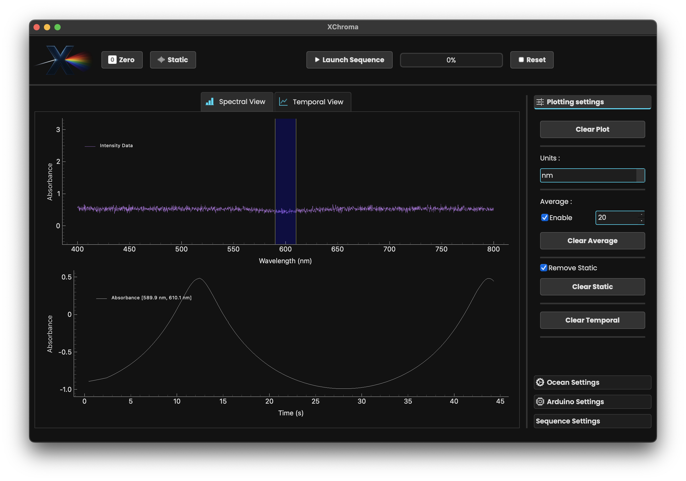

.. XChroma documentation master file, created by
   sphinx-quickstart on Tue Apr  1 15:22:05 2025.
   You can adapt this file completely to your liking, but it should at least
   contain the root `toctree` directive.

XChroma documentation
=====================

An app developped at `LOB <https://lob.ip-paris.fr>`_ to control an experimental setup for measuring ``switching quantum yields``.

.. grid:: 3

    .. grid-item-card:: :octicon:`rocket`  QuickStart
      :link: quickstart
      :link-type: doc

      Get up and running quickly with a step-by-step guide.

    .. grid-item-card:: :octicon:`project-roadmap`  User Guide
      :link: userguide
      :link-type: doc

      Detailed instructions on features, setup, and usage.

    .. grid-item-card:: :octicon:`code-square`  API Reference
      :link: code/XChroma
      :link-type: doc

      Comprehensive documentation for all available functions and classes.

The App
-------

Live **Spectrum Measurements**, **Absorbance Measurements** with easy static removal and baseline zero-ing.

**Full Control** of the OceanOptics spectrometer ``integration time``, ``acquisition time``.

.. image:: _static/captui.png
   :align: center
   :width: 600px

******************************

**Time-resolved** measurements, custom **avreaging** capabilities.

******************************

The Setup
---------

**Miniaturized** setup, ``200-1200 nm`` wavelength range, full control over the shutters via the app.

.. raw:: html

   

       
       

******************************

.. toctree::
   :maxdepth: 2
   :caption: Contents:

   quickstart
   userguide
   code/XChroma
